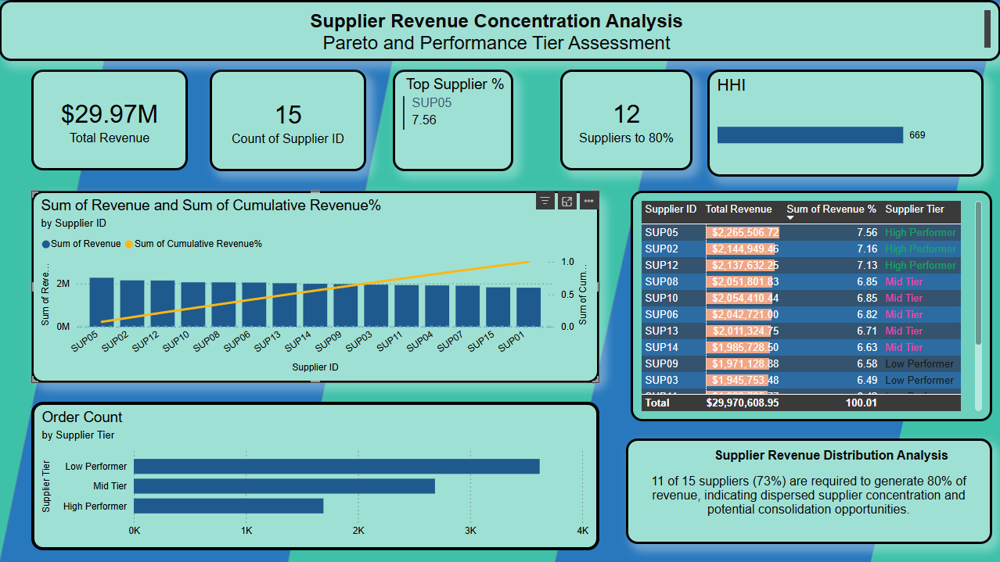

# Supply Chain Analytics: Supplier & Inventory Dashboard

## Overview

This project analyzes sales and inventory data to provide insights into supplier performance and inventory management. The main deliverable is a Power BI dashboard that highlights key metrics, helping businesses make informed decisions about reordering and supplier strategy.

---

## Business Problem

Efficient inventory and supplier management is critical for revenue and operational efficiency. Understanding supplier contributions, identifying high-risk areas, and monitoring key metrics ensures optimal stock levels and supports strategic decision-making.

---

## Data

* **Source:** Internal simulated sales and inventory dataset.
* **Content:** Clean, structured tables ready for analysis; no additional preprocessing was required.
* **Note:** The project focuses on generating insights directly from the dataset rather than performing a full ETL workflow.

---

## Approach

1. Explored trends in supplier performance and order patterns.
2. Used SQL scripts to prepare and aggregate data for analysis.
3. Created DAX measures for key metrics in the Power BI dashboard.
4. Built a dashboard to visualize supplier performance, revenue distribution, and order trends.

---

## Key Insights

* The dashboard identifies suppliers driving the highest revenue and tracks their contribution to overall sales.
* Metrics such as total revenue, order count by supplier tier, and supplier concentration (HHI, Pareto analysis, % of suppliers contributing to 80% of revenue) highlight areas of potential risk and opportunity.
* Top supplier performance and order patterns provide actionable insights for procurement and inventory planning.
* Detailed explanations and recommendations are provided in the [Executive Summary](./executive_summary.docx).

---

## Project Organization

```id="pwr8dx"
project-name/
├── README.md
├── dashboard/
│   ├── dax_measures/
│   └── sql_scripts/
├── dashboard_screenshot.png
├── initial_tables/       # screenshots from initial exploration
│   ├── table_1.png
│   └── Screenshots
└── executive_summary.docx
```

*The dashboard folder contains both DAX measures and SQL scripts. Visual outputs are captured in the dashboard screenshot and summary tables created during initial exploration.*

---

## Next Steps

* Automate monitoring of supplier performance and reorder triggers using calculated metrics.
* Develop an interactive dashboard in Power BI for real-time supplier and inventory insights.
* Explore predictive modeling for forecasting supplier demand and inventory needs.

---

## Dashboard Preview


